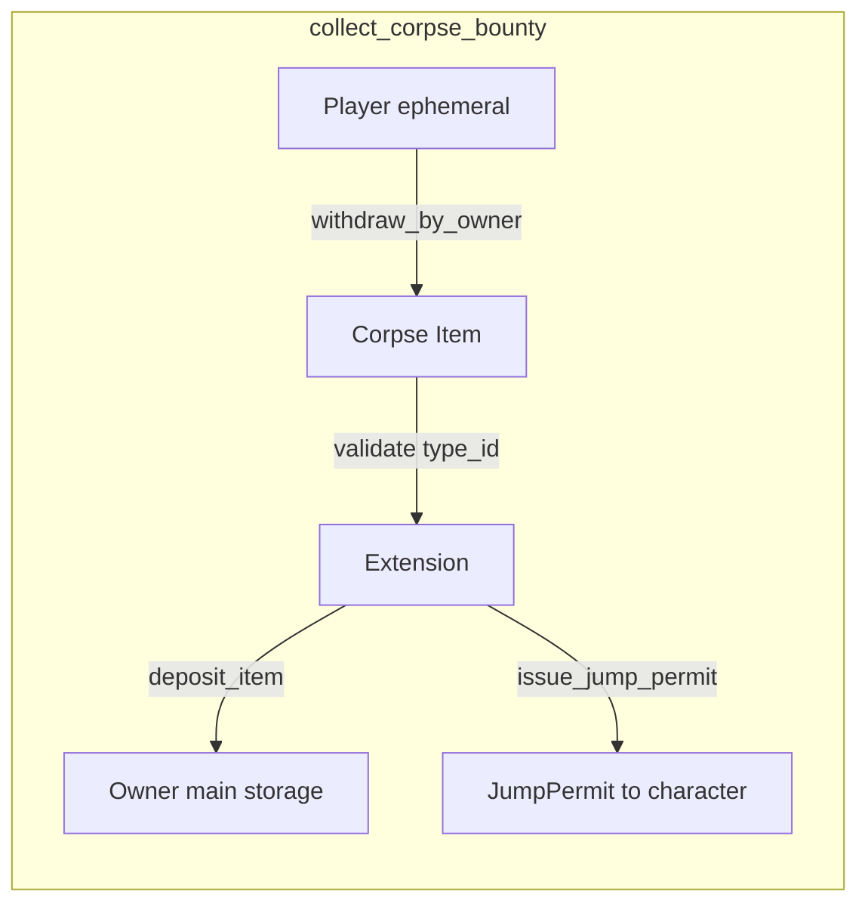
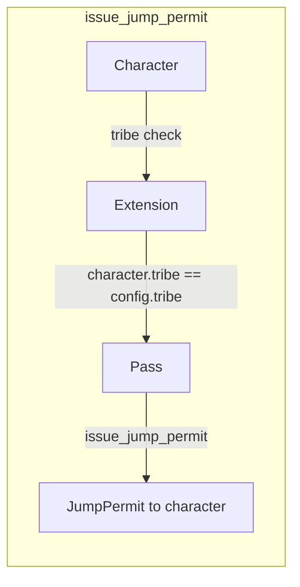
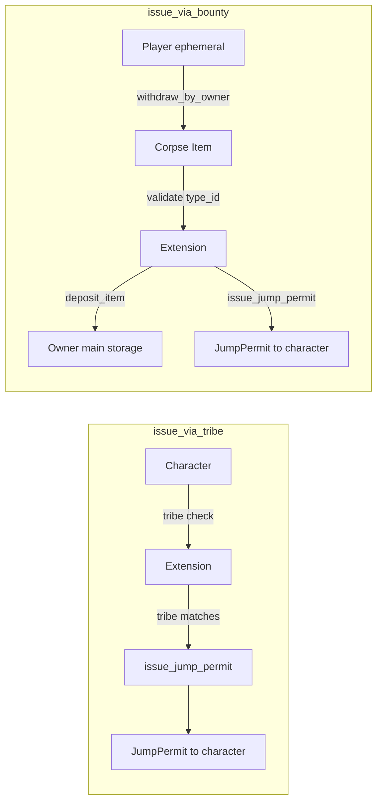

# Smart Gate Extension

Examples for extending the Gate assembly on EVE Frontier. Demonstrates custom jump rules using the typed-witness extension pattern.

**World dependency:** Local path `../../../world-contracts/contracts/world` (see [setup-world-with-version](../../scripts/setup-world-with-version.sh) to pin branch/commit)

## Examples

| Example        | Description                                                                 |
|----------------|-----------------------------------------------------------------------------|
| **Corpse bounty** | Collect a character corpse as bounty; deposit to owner storage; issue JumpPermit |
| **Tribe permit**  | Issue JumpPermit only to characters in a configured starter tribe           |
| **Tribe OR Bounty permit** | Combined extension: tribe members jump free, others pay a corpse bounty |

---

## Corpse Bounty

Collect a character corpse as bounty/payment to jump through a gate. The corpse is withdrawn from the player's ephemeral inventory and deposited into the gate owner's storage; a `JumpPermit` is issued to the character.

### Overview

1. **set_bounty_config** – Admin configures the extension (bounty_type_id, expiry_duration_ms) via `ExtensionConfig`.
2. **collect_corpse_bounty** – Player submits a corpse; extension validates type, deposits to owner storage, issues permit.

### Flow



### Extension Data Layer

- **ExtensionConfig** – Shared object (created at publish). Holds dynamic-field rules.
- **BountyConfig** – Stored under `BountyConfigKey`: `bounty_type_id`, `expiry_duration_ms`.
- **AdminCap** – Held by admin; required for `set_bounty_config`.

### Prerequisites

- Gate owner authorizes `XAuth` on the gate via `authorize_extension<XAuth>`.
- Gate owner authorizes `XAuth` on the storage unit (for `deposit_item`).
- Admin calls `set_bounty_config` to set bounty type and permit expiry.

### Scripts

- `pnpm configure-rules` – Sets both tribe and bounty config (run once).
- `pnpm collect-corpse-bounty` – Player collects bounty and receives permit.

---

## Tribe Permit

Issue jump permits only to characters belonging to a configured starter tribe. No payment; access is gated by `character.tribe()`.

### Overview

1. **set_tribe_config** – Admin configures allowed tribe and permit expiry via `ExtensionConfig`.
2. **issue_jump_permit** – Extension checks `character.tribe() == config.tribe`, then issues permit.

### Flow



### Extension Data Layer

- **ExtensionConfig** – Shared object (created at publish). Holds dynamic-field rules.
- **TribeConfig** – Stored under `TribeConfigKey`: `tribe`, `expiry_duration_ms`.
- **AdminCap** – Held by admin; required for `set_tribe_config`.

### Prerequisites

- Gate owner authorizes `XAuth` on the gate via `authorize_extension<XAuth>`.
- Once configured, travelers must use `jump_with_permit`; default `jump` is not allowed.
- Admin calls `set_tribe_config` to set allowed tribe and permit expiry.

### Scripts

- `pnpm configure-rules` – Sets both tribe and bounty config (run once).
- `pnpm issue-tribe-jump-permit` – Player receives permit (if tribe matches).
- `pnpm jump-with-permit` – Player jumps using the permit.

---

---

## Tribe OR Bounty Permit

A combined extension that provides two independent access paths on a single gate, sharing one `ExtensionConfig`:

- **Tribe path** (`issue_via_tribe`): Characters in the configured tribe jump for free — no payment.
- **Bounty path** (`issue_via_bounty`): Any character may jump by submitting a corpse item as payment.

Gate owners configure each path independently. Both paths use the same `XAuth` witness, so only one `authorize_extension<XAuth>` call is needed per gate.

### Overview

1. **set_tribe_config** – Admin sets allowed `tribe` and `expiry_duration_ms` via `ExtensionConfig`.
2. **set_bounty_config** – Admin sets `bounty_type_id` and `expiry_duration_ms` via `ExtensionConfig`.
3. **issue_via_tribe** – Character tribe is checked; if it matches, a `JumpPermit` is issued (no payment).
4. **issue_via_bounty** – Corpse item is withdrawn from the player's ephemeral inventory, deposited to the owner's storage unit, and a `JumpPermit` is issued.

### Flow



### Extension Data Layer

- **ExtensionConfig** – Shared object. Holds both `TribeConfig` (under `TribeConfigKey`) and `BountyConfig` (under `BountyConfigKey`) as dynamic fields.
- **TribeConfig** – `tribe: u32`, `expiry_duration_ms: u64`.
- **BountyConfig** – `bounty_type_id: u64`, `expiry_duration_ms: u64`.
- **AdminCap** – Required for `set_tribe_config` and `set_bounty_config`.

### Prerequisites

- Gate owner authorizes `XAuth` on the gate via `authorize_extension<XAuth>`.
- Gate owner authorizes `XAuth` on the storage unit (for `deposit_item` in bounty path).
- Admin calls `set_tribe_config` and/or `set_bounty_config` before players use the paths.

### Scripts

- `pnpm configure-rules` – Sets both tribe and bounty config (run once after publish).
- `pnpm authorise-gate` – Authorizes `XAuth` on the gate.
- `pnpm authorise-storage-unit` – Authorizes `XAuth` on the storage unit (required for bounty path).
- `pnpm issue-tribe-jump-permit` – Issues a permit via the tribe path.
- `pnpm collect-corpse-bounty` – Issues a permit via the bounty path (player pays corpse).

---

## Shared Configuration

All three examples use the same `ExtensionConfig` shared object and `AdminCap`:

| Component      | Purpose                                                                 |
|----------------|-------------------------------------------------------------------------|
| **ExtensionConfig** | Shared object with dynamic fields for per-extension rules (TribeConfig, BountyConfig) |
| **AdminCap**       | Transferred to publisher at init; gates `set_tribe_config` and `set_bounty_config`   |
| **XAuth**          | Typed witness authorized on gate and storage unit; used for `issue_jump_permit` and `deposit_item` |

All three examples share the same `ExtensionConfig` and `AdminCap` — only one `authorize_extension<XAuth>` call is needed per gate regardless of which path(s) you use.

---

## Prerequisites

- Sui CLI
- [world-contracts](https://github.com/evefrontier/world-contracts) at `../../../world-contracts/contracts/world`
- World deployed and configured (see [setup-world](../setup-world/readme.md))

**Pin world version:**

```bash
# Or: WORLD_CONTRACTS_BRANCH=main pnpm setup-world-with-version
cd ../world-contracts && git checkout main
```

---

## Build

```bash
cd move-contracts/smart_gate_extension
sui move build
```

---

## Test

```bash
cd move-contracts/smart_gate_extension
sui move test
```

---

## Publish

```bash
cd move-contracts/smart_gate_extension
sui client publish --gas-budget 100000000
```

After publishing:

1. Run `pnpm configure-rules` (or call `set_tribe_config` and `set_bounty_config`).
2. Run `pnpm authorise-gate` and `pnpm authorise-storage-unit` to authorize `XAuth` on the gate and storage unit.

---

## Scripts Summary

From repo root:

| Script                    | Purpose                                                          |
|---------------------------|------------------------------------------------------------------|
| `pnpm configure-rules`    | Set tribe and bounty config (run once after publish)             |
| `pnpm authorise-gate`     | Authorize XAuth on the gate                                      |
| `pnpm authorise-storage-unit` | Authorize XAuth on the storage unit (for corpse bounty)      |
| `pnpm issue-tribe-jump-permit` | Issue tribe jump permit to character                         |
| `pnpm jump-with-permit`   | Jump using a permit                                              |
| `pnpm collect-corpse-bounty` | Collect corpse bounty and receive JumpPermit                 |

---

## See Also

- [Typed witness pattern](https://github.com/evefrontier/world-contracts/blob/main/docs/architechture.md#layer-3-player-extensions-moddability)
- [move-contracts readme](../readme.md) for build and publish steps
