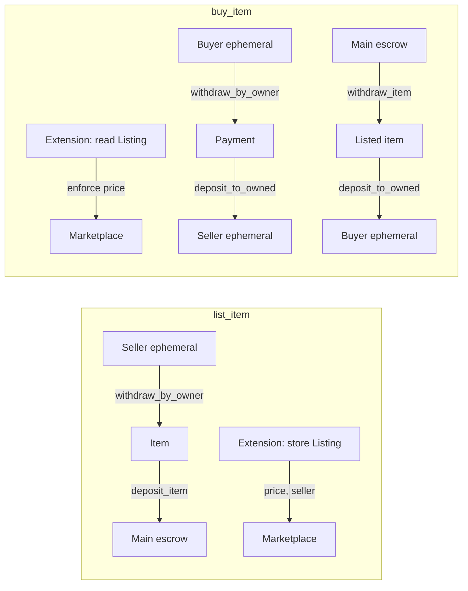
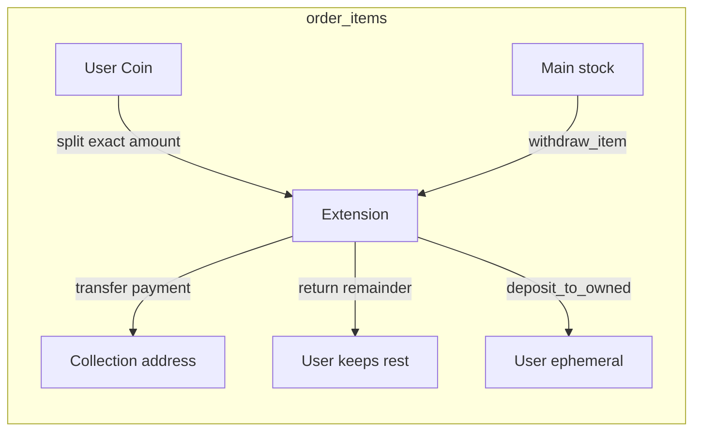

# Storage Unit Extension

Extensions for Storage Units on EVE Frontier: **Marketplace** (async trading) and **Supply Unit** (pay-to-supply vending).

**World dependency:** Local path `../../../world-contracts/contracts/world` (see [setup-world-with-version](../../scripts/setup-world-with-version.sh))

---

## Marketplace

Demonstrates async trading between players using `withdraw_by_owner`, `deposit_to_owned`, `withdraw_item`, and `deposit_item`.

### Overview

Listing data (price, payment type) lives in the extension's shared object (`Marketplace`). Main storage is used only for escrow until a buyer completes the trade.

1. **create_marketplace** – Storage owner creates the extension's shared object (once per storage unit).
2. **list_item** – Seller lists an item with a price (`payment_type_id`, `payment_quantity`). Item moves to main (escrow); listing metadata stored in the extension.
3. **buy_item** – Buyer purchases the listed item (seller can be offline). Extension enforces the stored price and completes the swap.

### Flow



### Extension Data Layer

- **Marketplace** – Shared object created by the storage owner. Holds the current `Listing` (type_id, quantity, seller_character_id, payment_type_id, payment_quantity).
- **Main storage** – Escrow only; no listing metadata lives on the storage unit.
- One active listing per marketplace (simple design; can be extended to support multiple listings).

### Item Model and Location

- **Item** carries `parent_id` – the Storage Unit it was withdrawn from.
- **Deposit checks:** `inventory::parent_id(&item) == storage_unit_id` and `inventory::tenant(&item) == storage_unit.key.tenant()`.
- Location is secured via shared parent check in Item data.

---

## Supply Unit

Pay-to-supply vending: users pay with `CURRENCY_TOKEN` to a collection address; upon payment the extension automatically deposits items into their ephemeral inventory on that storage unit. Price, collection address, and accepted currency are configured in the extension.

### Overview

1. **create_supply_unit** – Storage owner creates config: `storage_unit_id`, `collection_address`, `price_per_item`, `item_type_id`. One SupplyUnit per storage unit.
2. **stock_supply_unit** – Admin deposits item stock into main (withdraws from their ephemeral, passes to extension, extension deposits to main via `deposit_item<SupplyAuth>`).
3. **order_items** – User passes `payment: Coin<CURRENCY_TOKEN>`, `character`, `storage_unit`, `quantity`. Extension: sanity check user balance ≥ `price_per_item * quantity`; split exact payment via `coin::split`; transfer payment to `collection_address` (remainder stays with user); `withdraw_item` from main; `deposit_to_owned` to character.

### Flow



### Extension Data Layer

- **SupplyUnit** – Shared object: `storage_unit_id`, `collection_address`, `price_per_item` (u64), `item_type_id`, `accepted_currency` (type name for CURRENCY_TOKEN).
- **SupplyAuth** – Typed witness; storage owner authorizes via `authorize_extension<SupplyAuth>`.
- **Main storage** – Item stock; admin stocks via `stock_supply_unit`; extension withdraws via `withdraw_item`.

### Prerequisites

- Sui CLI
- [world-contracts](https://github.com/evefrontier/world-contracts) at `../../../world-contracts/contracts/world`
- World deployed and configured (see [setup-world](../setup-world/readme.md))

**Pin world version:**

```bash
# Set WORLD_CONTRACTS_BRANCH=main in .env (default), then:
pnpm setup-world-with-version
```

## Build

```bash
cd move-contracts/storage_unit_extension
sui move build
```

## Test

```bash
cd move-contracts/storage_unit_extension
sui move test
```

- **test_async_marketplace_trade** – Owner creates marketplace, onlines storage unit, and authorizes MarketAuth; seller lists Lens for 5 Ammo; buyer buys (seller offline); assertions: main empty; buyer has Lens; seller has Ammo.
- **test_supply_unit_create** – Owner creates supply unit config and authorizes SupplyAuth.

## Publish

```bash
cd move-contracts/storage_unit_extension
sui client publish --gas-budget 100000000
```

After publishing, the storage unit owner must call `create_marketplace` once per storage unit to create the extension's shared object. Then sellers can list items and buyers can purchase.

## See Also

- [Typed witness pattern](https://github.com/evefrontier/world-contracts/blob/main/docs/architechture.md#layer-3-player-extensions-moddability)
- [world-contracts](https://github.com/evefrontier/world-contracts)
